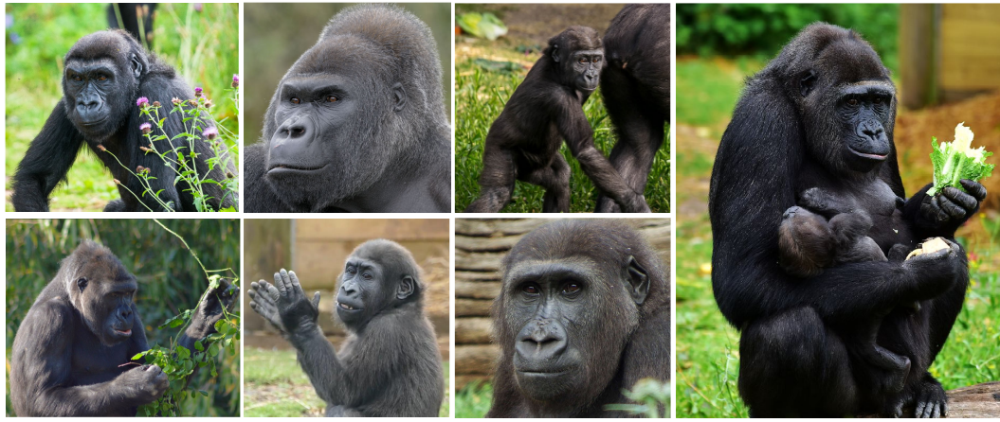

# BristolGorillas2020

## Introduction
An image dataset for the facial recognition of western lowland gorillas (*Gorilla gorilla gorilla*): the dataset comprises 5k+~facial bounding box annotations across a troop of 7 gorillas at Bristol Zoo Gardens. 



The reported results were produced using the darknet implementation of YOLOv3. The precise implementation can be found [here](https://github.com/obrookes/darknet). 

## Dataset details and structure

### Prerequisites

- The dataset is stored using Git Large File Storage and this need to be installed (instructions can be found [here](https://git-lfs.github.com)) before the repository can be cloned (downloading the repository as a zip file won't work, unfortunately).
- To reproduce the results the forked [darknet repository](https://github.com/obrookes/darknet) will need to be installed. I have provided the neccessary files to evaluate the network once this has been done. The `darknet_files` directory includes the `yolo-obj.cfg`, `obj.names`, `obj.data`, `train.txt`, `test.txt` and `.weights` files that are needed. The **How to train (to detect your custom objects)** section of the darknet repository will tell you where to put these files. Once the files are in the correct location run `darknet.exe detector map data/obj.data yolo-obj.cfg backup\yolo-obj_best.weights` from the directory where the darknet executable file is located - this will produce the desired mAP calculation. For more details on evaluation refer to the **When should I stop training** section (specifically **subsection 2.2**).             

### Images, Annotations & Network Weights

- The `images` directory contains all of the data and is already split into `train` and `test` sets.
- Each of the splits has a subdirectory for each gorilla (for example, `afia`, `jock` or `kala`.
- Each of the gorilla directories contains both images **and** annotations; this is because the darknet framework requires that images and annotations be placed in the same directory at training time.
- All images are JPEG format (`.jpg`)
- Annotations are text files (`.txt`)
- Annotation format: `<class> <x> <y> <width> <height>`
	- `<class>` = integer representing the object class
	- `<x>` = x-coordinate of the **centre** of the objects' bounding box
	- `<y>` = y-coordinate of the **centre** of the objects' bounding box
	- `<width>` = width of the bounding box
	- `<height>` = height of the bounding box

 AlexeyAB's comment on [this Github issue](https://github.com/AlexeyAB/Yolo_mark/issues/60) is very useful in providing clarification on the annotation format.

- The network weights are `.weights` files (a custom darknet format) and can be found in the `network_weights` directory

### Videos [Coming Soon!]

## Citation

This work was presented at the Visual observation and analysis of Vertebrate And Insect Behaviour workshop at the International Conference on Pattern Recognition (ICPR 2020). If you use this work as part of your research, please cite [A Dataset and Application for Facial Recognition of Individual Gorillas in Zoo Environments](https://arxiv.org/abs/2012.04689).

```text
@misc{brookes2020BristolGorillas,
      title={A Dataset and Application for Facial Recognition of Individual Gorillas in Zoo Environments}, 
      author={Otto Brookes and Tilo Burghardt},
      year={2020},
      maintitle={International Conference on Pattern Recognition 2020},
      booktitle={Workshop on the Visual Observation and Analysis of Vertebrate and Insect Behaviour},
      eprint={2012.04689},
      archivePrefix={arXiv},
      primaryClass={cs.CV}
}
```

## Acknowledgements

We would like to thank Stuart Gray, Faye Clark & Peter Bennet of the [Gorilla Game Lab](https://gorillagamelab.com)! We would also like to thank Bristol Zoo Gardens for facilitating this research.

## Contact

If you require any assistance or are interested in this research, please do not hesitate to [email me](mailto:dl18206@bristol.ac.uk) or [Tilo Burghardt](mailto:tilo@cs.bris.ac.uk).
