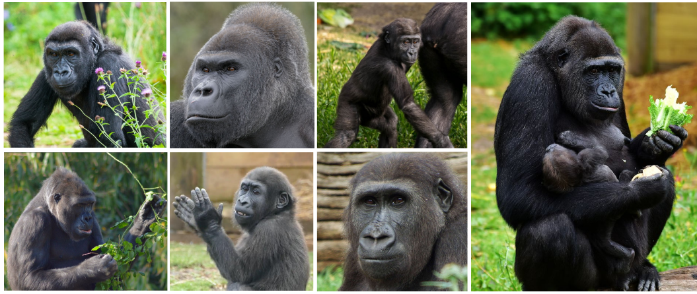

# BristolGorillas2020

### Introduction

An image dataset for the facial recognition of western lowland gorillas (*Gorilla gorilla gorilla*).The dataset comprises 5k+~facial bounding box annotations across a troop of 7 gorillas at Bristol Zoo Gardens. The paper which accompanies this dataset was published at [ICPR 2020: Visual obersation & analysis of veterbrate & insect behaviour](https://homepages.inf.ed.ac.uk/rbf/vaib20.html) and can be found [here](https://arxiv.org/pdf/2012.04689.pdf).

The reported results were produced using the darknet implementation of YOLOv3. The precise implementation can be found [here](https://github.com/obrookes/darknet). 

### Dataset details and structure

The dataset is stored using Git Large File Storage and this will need to be installed (instructions can be found [here](https://git-lfs.github.com)) before the repository can be cloned (downloading the repository as a zip file won't work, unfortunately). 

#### Images, Annotations & Network Weights
- The `images` directory contains all of the data and is already split into `train` and `test` sets.
- Each of the splits has a subdirectory for each gorilla (for example, `afia`, `jock` or `kala`.
- Each of the gorilla directories contains both images **and** annotations; this is because the darknet framework requires that images and annotations be placed in the same directory at training time.
- All images are JPEG format (`.jpg`)
- Annotations are text files (`.txt`) and follow the darknet format (AlexeyAB's comment on [this Github issue](https://github.com/AlexeyAB/Yolo_mark/issues/60) is very useful in providing clarification on this).
- The network weights are `.weight` files (a custom darknet format) and can be found in the `weights` directory

To reproduce the results the following darknet repository will need to be installed <https://github.com/obrookes/darknet>.    

